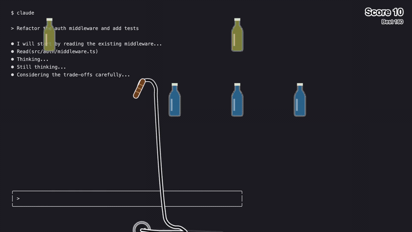

# OpenWhip


Sometimes claude code is going too shlow, and you must whip him into shape..

Or pat him on the shoulder. Your call.



## Install + run

```bash
npm install -g openwhip
openwhip
```

windows and mac supported out of the box, but Linux is a special snowflake so you need to install `xdotool` for keyboard automation

```bash
sudo apt install xdotool
```

## Controls

- Click the Dock or tray icon, or press `Option+Shift+W` (`Alt+Shift+W`): spawn whip.
- Right-click tray icon: quit.
- Flick, then click while the whip is snapping: that is a strike. It sends an interrupt (Ctrl-C) and one of the encouraging messages!
- A click with a still whip does nothing. Fast flicks alone crack with sound and sparks but never type.
- Right click: drop whip.
- Scroll wheel or middle click: switch between whip and pat without leaving the screen.
- Smash the bottles on the shelves for points. Fast hits in a row multiply the score; your best is kept.

## Pat on the shoulder

For the days he deserves it. Press `Option+Shift+P` (`Alt+Shift+P`) or pick it from the tray menu: a hand follows
your mouse. Left click pats him, sends a kind word (no interrupt, just the message and Enter) and floats some hearts.
Right click waves goodbye. Scroll or middle click swaps back to the whip. From a terminal, `openwhip pat` summons the
hand and `openwhip whip` the whip; plain `openwhip`, the Dock icon and the tray icon reopen whichever you used last.
Right click the Dock icon for a Whip / Pat menu.

## macOS setup

On first run `openwhip` builds `OpenWhip.app` inside the package (a renamed, re-signed copy of the bundled
Electron with the whip icon) and launches it through `open`, so macOS sees an app called OpenWhip rather
than your terminal. Typing into the focused app needs Accessibility access for it: when macOS prompts,
open System Settings > Privacy & Security > Accessibility and turn on **OpenWhip**. If it is not listed:

```bash
open -R "$(npm root -g)/openwhip/OpenWhip.app"
```

Drag it onto the list and turn it on.

If `openwhip` prints `Could not load Electron` on Node 26, electron's postinstall failed to unzip its binary.
Reinstall on Node 22 or 24 (`nvm use 24 && npm install -g openwhip`).

## Roadmap

- [x] Initial release! 🥳
- [x] Cease and desist letter from Anthropic
- [ ] Crypto miner
- [ ] Logs of how many times you whipped claude so when the robots come we can order people nicely for them
- [ ] Updated whip physics

## Ecosystem

The OFFICAL openwhip ecosystem token. 

Contract address: BRyUZbJkm9Pty4FUmTrBGno7U4Ga8TWzcKJJRLCBpump

Stay tuned for updates on X! 👀
https://x.com/blended_jpeg